Introduction
============
Dungeon Architect comes bundled with several examples to quickly get you started.  The samples below use assets that are freely available (e.g. Infinity Blade's Assets) and some are built on other paid assets, which you can readily use if you have them already.

Download Content Pack
=================================
**[Download](https://github.com/coderespawn/dungeon-architect-quick-start-ue4/archive/content_2.x.zip)** the Quick Start Content pack for Dungeon Architect version **2.x**

Plugin Installation (Manual)
============================
If you have purchased the plugin from the Marketplace, install it from the Epic Launcher

If you have purchased it from the website,  follow these steps:

* Create a directory named Plugins in your game's root directory
* Extract the content of the downloaded plugin into the plugins directory. All major versions of UE4 are supported since 4.7. Choose the appropriate one to copy into the Plugins folder 

* Refer the [User Guide](https://coderespawn.github.io/dungeon-architect-user-guide-ue4) for more info
 
**Installation Video Tutorial**

YOUTUBE(JqPlrRxKHgA)

Build a dungeon (Design Time)
=============================
The plugin comes with sample assets and maps to get you started. Open the test map where everything is already setup

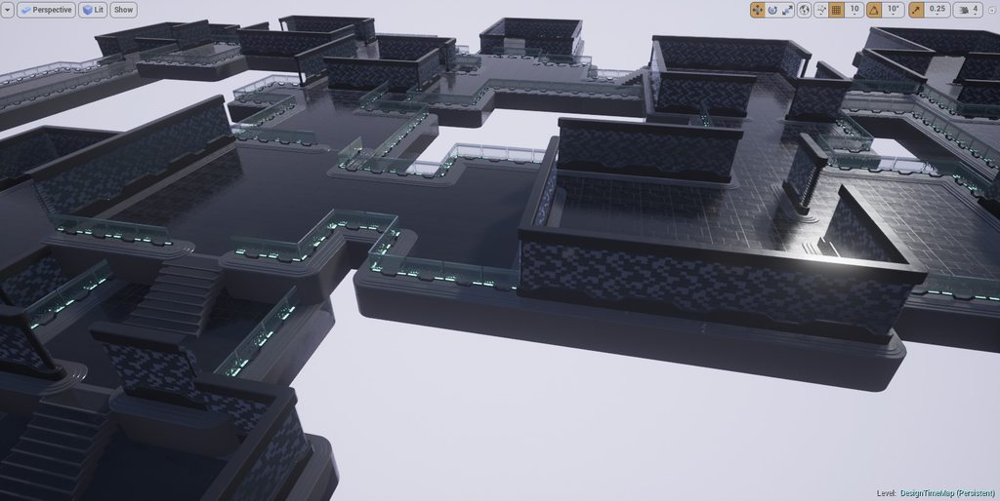

* Install Dungeon Architect plugin
* Download and extract the Quick Start Content Pack
* Copy the extracted `Content/DA_StarterPack` folder into your game's `Content` folder

* Open the sample map by navigating to `Content > DA_StarterPack > Maps > DugeonDesignTime`
* From the world outliner, click the Dungeon1 Actor.
* In the details panel, you will find 3 buttons in the Dungeon category. Click the "Build Dungeon" button. This will create a procedural dungeon in your scene using a sample theme you just extracted
* The config structure contains various parameters that can be tweaked to get different results

To build this setup yourself from scratch, refer the [User Guide](https://coderespawn.github.io/dungeon-architect-user-guide-ue4)

YOUTUBE(D1xhX0fEnVw)

Build a dungeon (Runtime)
=========================
Random dungeons can be created at runtime (e.g. during level load) using a random seed (some number) and various tweakable parameters and have the map populated with powerups, spawn points, NPCs etc. All this can be done using pure blueprints and this sample map shows you how to do it

* Install Dungeon Architect plugin
* Copy the extracted `Content/DA_StarterPack` folder into your game's `Content` folder
* Open the sample map by navigating to `Content > DA_StarterPack > Maps > DungeonRuntime`
* The scene is empty. Click the play button to have the procedural scene generated at runtime. A different level is generated on each run
* Open the level blueprint to see how this is done

YOUTUBE(uowWAVwEiEc)

Level Authoring by Players (Runtime)
====================================

Dungeon Architect empowers not just your level designer, but also your players. This sample shows how you can have an in-game level editor and let your player design the layout of the levels. Most of the heavy lifting is done by the plugin. This game mode is designed entirely in blueprints.

* Install Dungeon Architect plugin
* Copy the extracted `Content/DA_StarterPack` folder into your game's `Content` folder
* Open the sample map by navigating to `Content > DA_StarterPack > Maps > RuntimeLevelBuilder`
* Do **not** build the dungeon. Just hit play

**Controls**

* Use WASD to move around
* Hit space to enter / exit build mode
* In build mode, Left click to draw, right click to erase
* Use the mouse wheel to change level (height)

YOUTUBE(Xor9nxeNoO4)

Infinity Blade: Fire Lands Theme (Hell Forge)
=============================================

Generate beautiful cave like procedural levels using assets from Infinity Blade's Fire Lands asset pack

YOUTUBE(dbDak6J61zw)

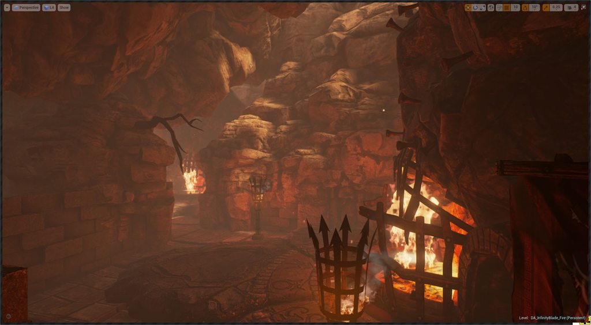
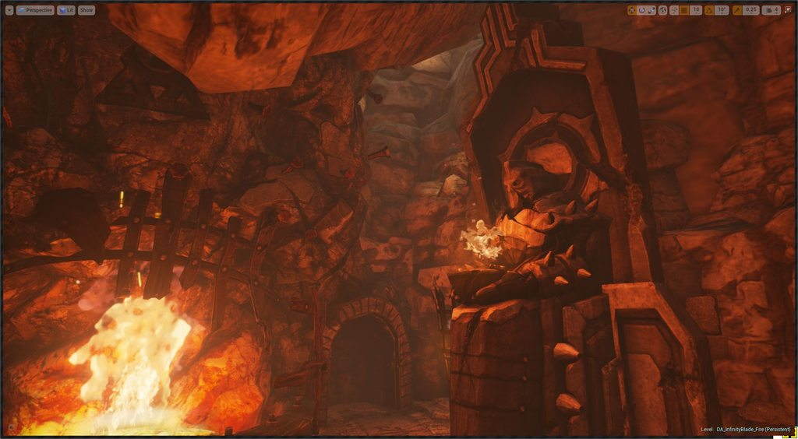

* Create a new project (e.g Third Person)
* Install Dungeon Architect plugin
* Add the [Infinity Blade Fire Lands](https://www.unrealengine.com/marketplace/infinity-blade-fire-lands) pack in your game project
* Add the [Infinity Blade Effects](https://www.unrealengine.com/marketplace/infinity-blade-effects) pack in your game project
* Copy the `Content/DA_InfinityBlade_Fire` folder into your game's Content folder
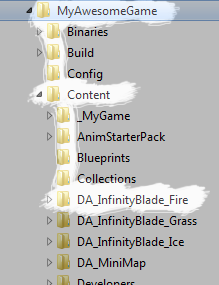
* Explore the maps in the `Content/DA_InfinityBlade_Fire/Maps` folder

Infinity Blade: Ice Lands Theme (Frost Forge)
============================================

Generate beautiful procedural levels using assets from Infinity Blade's Ice Lands asset pack

YOUTUBE(IBubKo3hzqU)

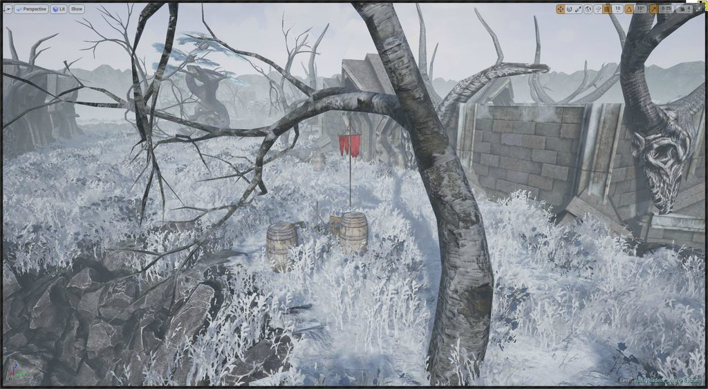
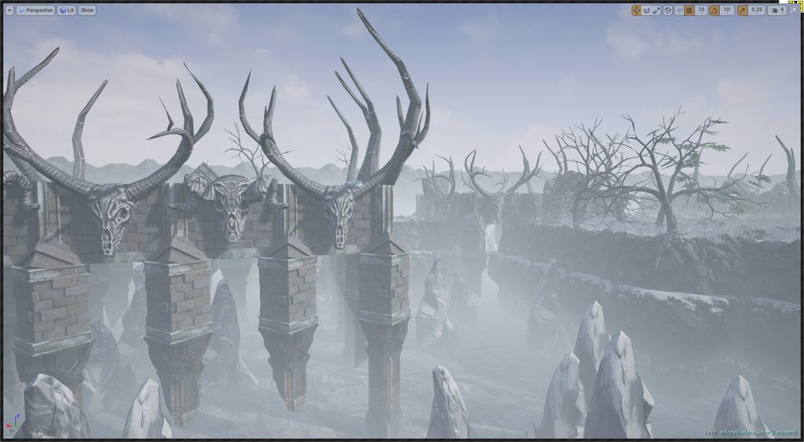

* Create a new project (e.g an Third Person)
* Install Dungeon Architect plugin
* Add the [Infinity Blade Ice Lands](https://www.unrealengine.com/marketplace/infinity-blade-ice-lands) pack in your Content folder
* Copy the `Content/DA_InfinityBlade_Ice` folder into your game's `Content` folder

* Explore the maps in the `Content/DA_InfinityBlade_Ice/Maps` folder

Infinity Blade: Grass Lands Theme (Elven Gardens)
=================================================

Generate beautiful procedural levels using assets from Infinity Blade's Grass Lands asset pack

YOUTUBE(MkYJn2egYys)

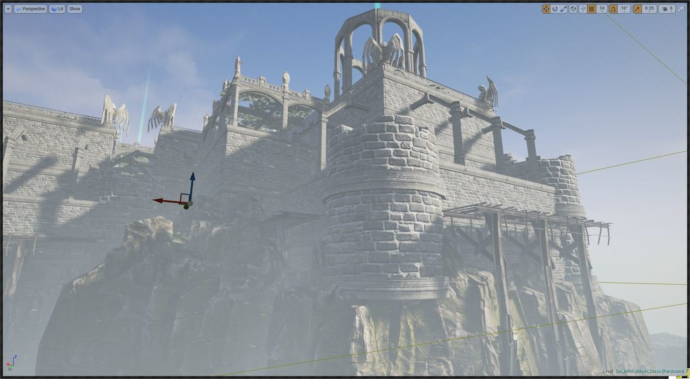
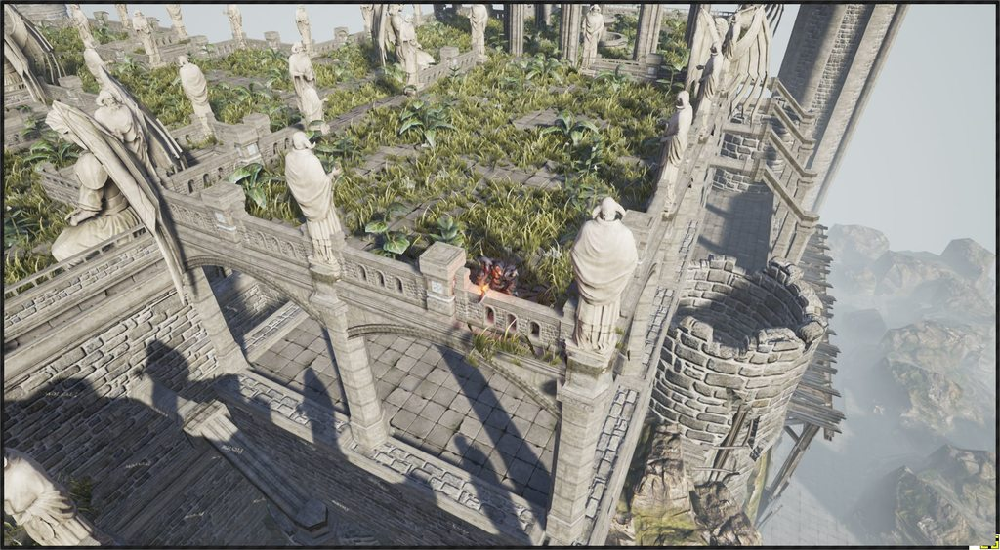

* Create a new project (e.g an Third Person)
* Install Dungeon Architect plugin
* Add the [Infinity Blade Grass Lands](https://www.unrealengine.com/marketplace/infinity-blade-plain-lands) pack in your game project
* Add the [Infinity Blade Effects](https://www.unrealengine.com/marketplace/infinity-blade-effects) pack in your game project
* Copy the `Content/DA_InfinityBlade_Grass` folder into your game's `Content` folder
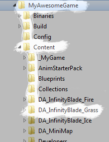
* Explore the maps in the `Content/DA_InfinityBlade_Grass/Maps` folder

Candy
=====
A simple theme created using royalty-free assets

* Install Dungeon Architect plugin
* Copy the `Content/DA_Candy` folder into your game's `Content` folder
* Explore the maps in the `Content/DA_Candy/Maps` folder

Basic Top-Down Theme
====================
The very basic theme created using simple shapes

YOUTUBE(7nj2pttBUTw)
YOUTUBE(bkIaHRJP4CA)

* Create a new project (e.g a Top-down game)
* Install Dungeon Architect plugin
* Copy the `Content/DA_TutorialGame` folder into your game's `Content` folder
* Explore the maps in the `Content/DA_TutorialGame/Maps` folder

Procedural Deathmatch Map
=========================
Generate a random map at runtime with AI bots, powerups, spawn points etc scattered all over the map using only blueprints. It also shows you how to setup multiplayer dungeons, where the server propagates the dungeon seed value to all the clients so they generate the exact same dungeon

YOUTUBE(VZIIEQoMp7o)
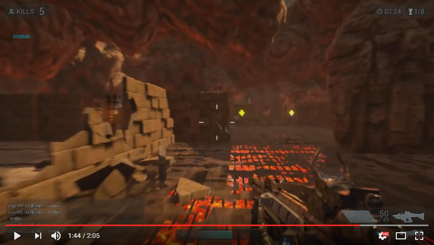

Follow the installation steps [here](https://github.com/coderespawn/dungeon-architect-ue4-demo-dm)

Scifi Theme
===========
A set of theme files to generate sci-fi levels using the awesome [SciFi Props Pack](https://www.unrealengine.com/content/4bfaed169f2d47e69a741afe7126d018)

YOUTUBE(kef5xQQbNiQ)

* Create a new project (e.g an FPS project)
* Install Dungeon Architect plugin
* Install the [SciFi Props Pack](https://www.unrealengine.com/content/4bfaed169f2d47e69a741afe7126d018) to your project
* Copy the `Content/DA_SciFi_Props` folder into your game's `Content` folder

* Open the demo map `Content/DA_SciFi_Props/Maps/ScifiMapDemo`
* Select the `Dungeon1` actor and click *Build Dungeon* from the Details window

Wooden Pier Theme
=================

A theme file to generate levels using the awesome [Modular Wooden Prop Pack](https://www.unrealengine.com/content/41a805989d4440e0bb91eb0dd3450ed4)

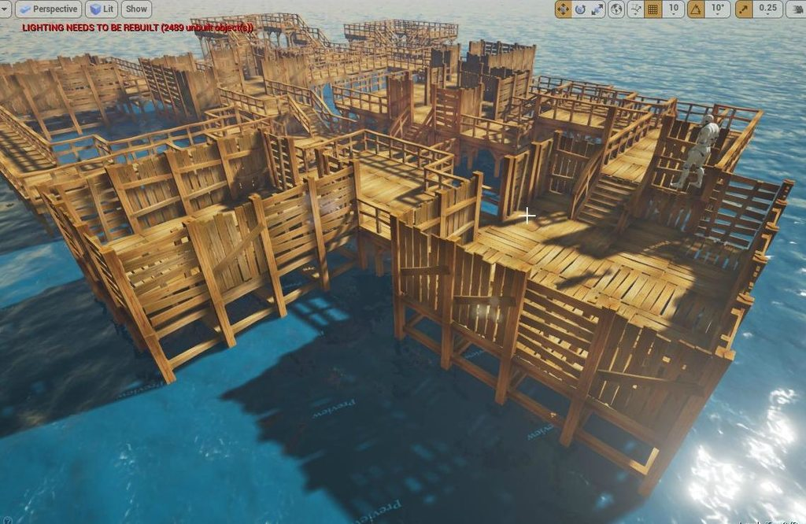
YOUTUBE(tGOclVH-10s)

* Install Dungeon Architect plugin
* Install the [Modular Wooden Prop Pack](https://www.unrealengine.com/content/41a805989d4440e0bb91eb0dd3450ed4) to your project
* Copy the `Content/DA_WoodenPier` folder into your game's `Content` folder
* Explore the maps under `Content/DA_WoodenPier/Maps`

Floor Plan Demo
===============
Build floor plans for your indoor levels using the new Floor Plan Builder.    

YOUTUBE(K_iQH4TiVS0)

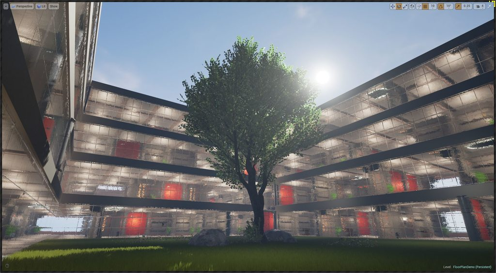
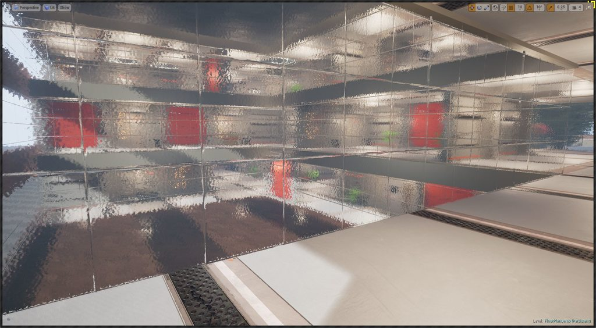

* Create a new project (has to be First Person Blueprint, since the demo uses a modified player controller for the lift buttons to work)
* Install Dungeon Architect plugin
* Install [Sci-Fi Hallways](https://www.unrealengine.com/marketplace/scifi-hallway) (it's ok to install an older compatible version)
* Copy the `Content/DA_Floorplan_Demo` folder into your game's `Content` folder
* Open the map `Content/DA_Floorplan_Demo/FloorPlan/OfficeBuilding`
* Press **E** to call the lift programmed in the demo

Outdoor Cliff
=============
An outdoor theme built with free assets

YOUTUBE(_RdZeXH8LGY)

* Install Dungeon Architect plugin
* Copy the `Content/DA_OutdoorCliff` folder into your game's `Content` folder
* Open the map `Content/DA_OutdoorCliff/ToonLand`

Scifi Theme 2 (Manufactura K4)
==============================

A set of theme files to generate levels using the awesome [Top-Down Sci Fi](https://www.unrealengine.com/content/7f5f95c832e04440a402fd1d338dbd7e) pack

YOUTUBE(qjLxol2kvqg)

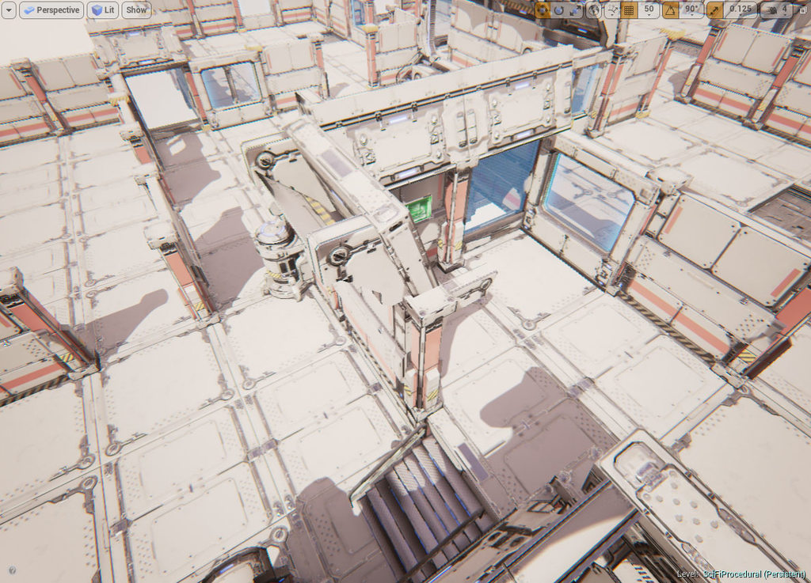
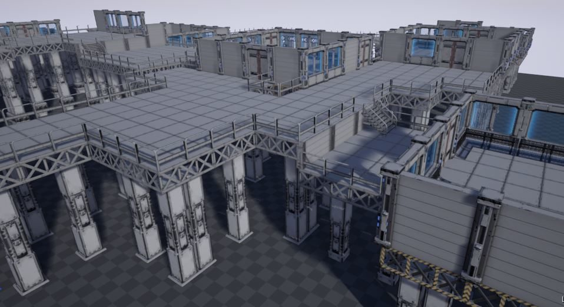

* Create a new project (e.g an FPS project)
* Install Dungeon Architect plugin
* Install [Top-Down Sci-Fi](https://www.unrealengine.com/content/7f5f95c832e04440a402fd1d338dbd7e) pack to your project
* Copy the `Content/DA_SciFi_K4` folder into your game's `Content` folder
* Top-Down Theme:
    * Open the demo map `Content/DA_SciFi_K4/Maps/DATopDown`
    * Select the `Dungeon1` actor and click *Build Dungeon* from the Details window
* FPS Theme:
    * Open the demo map Content/DA_SciFi_K4/Maps/DAFPS
    * Select the `Dungeon1` actor and click *Build Dungeon* from the Details window
* Oil Rig Theme:
    * Open the demo map Content/DA_SciFi_K4/Maps/DAOilRig
    * Select the `Dungeon1` actor and click *Build Dungeon* from the Details window 
* Tweak the parameters and rebuild for a different dungeon. Try painting the layout with the paint tool

Isaac Builder Demo Map
=======================
A demo map showcasing the Isaac builder

YOUTUBE(eRrh-SLcJ0A)

* Create a Third Person Blueprint project
* Install Dungeon Architect plugin
* Copy the `Content/DA_Isaac_Demo` folder into your game's `Content` folder
* Open the map `Content/DA_Isaac_Demo/IsaacDemo`

Snap Builder Demo Map
=====================
A demo map showcasing the Snap builder

YOUTUBE(g4IXs_ns1NY)

**COMING SOON**

Support
=======

* [Forum Support Thread](https://forums.unrealengine.com/showthread.php?67599-Dungeon-Architect)
* [Website](http://coderespawn.com)

